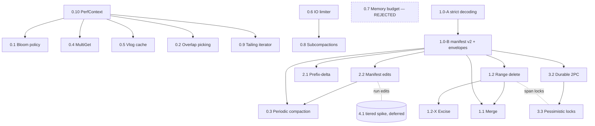

# Forward roadmap implementation plan

> **For agentic workers:** read [Execution protocol](#execution-protocol-for-agentic-workers)
> before touching code. Each feature document is the unit of work; derive a
> task-by-task plan from its "Implementation tasks" section, use test-driven
> development and the repository's crash/fault-injection patterns
> (`tests/engine_regressions.rs`, `tests/parts.rs` crash tests). Do not execute
> this roadmap as one commit.

**Goal:** close the selected storage-engine gaps without weakening ondaDB's
durability ordering, manifest serialization, checksum coverage, gap-free
visibility, rotation protocol, comparator stability, pinned-block lifetime, or
part-move ordering invariants (AGENTS.md "Critical invariants" 1–9).

**Baseline:** ondaDB **0.8.2** at commit `3afc3c1` (`Cargo.toml` version
`0.8.2`). All plan text, identifier citations, and readiness statements are
verified against that tree.

**Source:** wavesdb `docs/plans/` at `1a052a4`; every adopted design cites its
wavesdb counterpart. The wavesdb validation ledger's corrected decisions are
incorporated here rather than re-derived.

## Global constraints

- Every change keeps **both feature configurations green**:
  `cargo build` / `cargo build --features unsafe-fastpath`, and the four
  CI-equivalent commands in AGENTS.md. Check each test binary for the *presence
  of* `test result: ok`, never pipe through `tail`.
- Default build stays `#![deny(unsafe_code)]` (lib.rs); new `unsafe` needs a
  documented contract in `docs/concurrency-and-safety.md` and a measured
  justification. No async runtime — std threads and channels only.
- Defaults preserve current behavior unless a feature document explicitly
  argues for a measured default change.
- Unknown durable capabilities, record kinds, and modifier bits **fail closed**
  with a distinguishable error (`OndaError::Corruption` for malformed bytes; a
  new `OndaError::UnsupportedFormat(String)`, code `-16`, for unknown
  versions/capabilities — see 1.0). `-16` is the first free code today
  (`error.rs` ends at `Poisoned` = `-15`).
- Existing manifests (VERSION 1), WALs, and klogs remain readable forever.
- A new persisted option is wired in the same change: the `Options` /
  `ColumnFamilyConfig` field, `Default`, `validate`, the `encode`/`decode`
  config blob (append-tolerant tail, new `CONFIG_*_MAGIC` tag), docs, and a
  reopen test. `ONDABLK1` (`data_block_size`, landed in 0.8.2) is the pattern:
  the encoder elides the value when it equals the default, so old blobs still
  decode. ondaDB has no yaml/env surface; do not invent one.
- Mount/unified/object-store/checkpoint/backup/ingest/close behavior is either
  tested or explicitly refused at the API boundary.
- Every performance claim is gated on local before/after evidence per
  `docs/performance.md` (thermally noisy machine: ≥5 runs, same-run ratios).
  Cited upstream numbers (RocksDB, Pebble, Monkey, SILK) are motivation, not
  acceptance thresholds.

## Wave 0 — landed in 0.8.2

The August 2026 code review's corrective work shipped in 0.8.2 and is recorded
finding-by-finding in [`../code-review-2026-08-resolution.md`](../code-review-2026-08-resolution.md):
F1–F5, M1, M2, M4, M6, M7, M8, M9 and L1–L4 are fixed with regression tests;
M10, L5 and L6 were closed with no code change after measurement. Nothing in
this roadmap is gated on redoing that work — plans must *verify* the fixed
behavior, not re-implement it. Concretely: tiered backup/checkpoint/clone are
self-contained (F1), attach stages disjointly and propagates
`StorageWriter::finish` failures (F2, F4), per-CF WAL mode rejects multi-CF
transactions before reserving sequences (F3), WAL stripe creation fsyncs its
parent (F5), `spawn_workers` starts `num_compaction_threads.max(1)` compaction
consumers (M7), `ColumnFamilyConfig::data_block_size` is a live persisted
4 KiB-default option (M6), and `MAX_MANIFEST_LEVEL = 64` bounds manifest levels
(M9).

Two review items remain open, and both are scheduled rather than gating:

| Open item | Status | Where it lands |
| --- | --- | --- |
| M3 — `commit_mu` couples WAL/apply latency to validation | Deferred; no correctness failure under current locking. Dropping the lock needs write intents or a second validation/publication protocol. | Re-measured (not fixed) by 3.2's reservation check and 1.2's range commits; both must report the cost. |
| M5 — full manifest rewrite cost at scale | Deferred; the `manifest_encoded_size_at_scale` probe is the sizing evidence. | Feature **2.2** (manifest edit log) is the fix. |

The documented S3 gaps in AGENTS.md are unchanged and out of scope here:
`sweep_move_orphans` and compaction's obsolete-input delete
(`remove_compaction_inputs`) are default-tier-path only, so a crash mid-move or
a compaction of an S3-resident part leaks the object. The manifest stays
authoritative, so reads are never affected. Any feature touching those paths
must not widen the leak, and must say so in its failure matrix.

## Dependency waves

### Wave A — compatibility and measurement foundation

1. **0.10 PerfContext** — per-operation evidence and the machine-readable
   bench output mode every later gate consumes.
2. **1.0 strict decoding + manifest v2 capabilities + record envelopes** — the
   gate for every durable feature (0.3, 1.1, 1.2, 2.1, 2.2, 3.2).

Nothing durable ships before 1.0 Change B. Strict decoding (Change A) can ship
first and alone.

### Wave B — reversible runtime work

Order: **0.2** (overlap picking) → **0.5** (vlog value cache) → **0.6** (IO
classes/limiter, then paced deletes) → **0.4** (MultiGet) → **0.9** (tailing
iterator) → **0.1** (per-level bloom) → **0.8** (subcompactions, after 0.6's IO
classes). Each is a separate review and a separate revert.

**0.7 (global memtable budget) is rejected**, not deferred:
`Options::max_memory_usage` stays a documented-reserved field. Its feature
document is a decision record — the reasons (a budget check on the write path
would sit inside the `commit_mu` window that M3 already indicts, and there is
no consumer asking for it) and what would reopen it.

### Wave C — durable record and format capabilities

Order: **2.2** → **0.3** → **2.1** → **1.2** → **1.1**.

1. **2.2 manifest edit log** — local snapshot + numbered edits; the M5 fix, and
   the prerequisite that makes every later manifest-touching feature cheap.
   Pull it earlier if parts-count growth demands it.
2. **0.3 periodic compaction** — needs 2.2's cheaper manifest writes and 1.0's
   `CAP_PERIODIC_AGE` for the new `SstMeta` age field.
3. **2.1 prefix-delta data blocks** — table-level encoding behind
   `CAP_PREFIX_DELTA`; independent of the record-kind work.
4. **1.2 range tombstones**, then excise as a second deliverable. Scheduled
   before 1.1 because 1.1's retention change reuses 1.2's `VersionRetention`
   slice.
5. **1.1 merge operators** — last, on top of 1.2's retention plumbing.

Enabling one capability must never implicitly enable another.

### Wave D — transaction modes

Order: **3.2** → **3.3**.

1. **3.2 durable 2PC**, unified WAL layout only. No longer product-gated: a
   coordinator consumer (ayu/spada) exists, so this is scheduled work.
2. **3.3 pessimistic locking** — point locks first; span locks after 1.2 gives
   an interval representation. Lock conversion at prepare (composition with
   3.2) is in scope as its own slice with its own recovery rows.

## Dependency graph



## Wave gates

| Wave | Entry gate | Exit gate |
| --- | --- | --- |
| A | Frozen legacy-decoder fixture corpus committed (1.0 task 1) | PerfContext nil path within noise; strict-decoding fuzz/golden corpus green; v2 golden bytes pinned; persist-before-use proven under injected crashes; `onda_bench`/`../bench` emit machine-readable per-phase JSONL |
| B | Wave A exit (0.2/0.5 may start on A task 1 alone); one prebuilt multi-level fixture generator committed | each retained feature has baseline/candidate runs with ≥5 repetitions (≥10 when variance is material), docs, config wiring, both feature configs green; every rejected feature has a result note and no dormant code |
| C | Wave A exit; capability registry frozen (see below); catalog-diff inventory test (2.2 task 1) lists every persisted manifest field | mixed legacy/new fixtures scan identically; crash matrix per feature complete; old-binary refusal proven with a frozen decoder |
| D | Wave A exit; envelope kinds 16–31 reserved for prepare/decision; unified-layout crash harness exists | recovery idempotent across repeated opens; WAL pins provably released; conflict outcomes per isolation level pinned by tests |

## Identifier contract

Plans cite only names that exist at **0.8.2 (`3afc3c1`)**, or mark a name
**new**. Every entry below was re-verified against `src/` for this rewrite —
that verification is the point of the table, because plan text using a name
outside it must be labelled **new**.

| Area | Existing identifiers |
| --- | --- |
| db | `DbInner::persist_manifest` (`manifest_mu`, full rebuild), `publish_range`/`PublishState`, `reserve_seq`, `observe_seq`, `acquire_snapshot`/`release_snapshot`, `spawn_workers` (spawns `num_compaction_threads.max(1)` compaction consumers over a cloned `rx`; default `num_compaction_threads = 2`), `flush_worker`/`compact_worker` (`recv_timeout(WORKER_TICK)`, `WORKER_TICK = 50ms`), `flush_per_cf`/`flush_unified`, `remove_sst_file`/`pause_deletions`/`DeletionPause`/`FileDeletionState {disabled, pending}`, `sweep_move_orphans`/`sst_is_misplaced`, `run_part_mover`/`mover_running` (CAS guard), `ensure_instance_nonce`, `acquire_dir_lock`, `THREAD_COMMIT_FLOOR`, `close` |
| column_family | `CfState {mem, wal, wal_gen, pending_wals, imm, levels}`, `rot`/`RotState`, `apply_commit` (gate: rotating / imm ≥ `l0_queue_stall_threshold` / hard debt), `active_writers`, `rotate_memtable`, `flush_imm`/`write_l0`/`write_l0_streaming`/`install_handles_l0`/`finish_writer_to_handle`, `get`/`point_read_sources`/`PointReadSources`/`consider_sstables`/`find_overlapping` (binary search for the one covering table at level ≥ 1)/`peek_seq`, `new_iterator`/`iterator_children`/`append_memtable_children`, `update_levels`/`install_levels` (atomic, debug-assert), `take_fifo_victims`, `bottom_partition_handles`/`remove_bottom_tables`/`bottom_overlaps`/`insert_bottom_sorted`/`swap_bottom_tables`, `bottom_parts`, `klog_path_for`/`handle_for`/`open_reader_for`, `effective_config`/`append_partition_rule`, `partition_resolver_snapshot`, `compaction_debt`/`pace_for_compaction_debt`/`record_compaction_failure`, `DEFAULT_DATA_BLOCK_SIZE` (= `sst::DEFAULT_BLOCK_SIZE`), `MAX_MANIFEST_LEVEL = 64` |
| txn | `Txn {buf, writes, read_set, read_log, read_cfs, savepoints}` (`read_log` is the L3 first-insertion order that makes savepoint rollback drop only later reads; `savepoints` entries are `(name, writes_len, buf_len, read_log_len)`), `deduplicated_write_order`, `apply_prepared`/`apply_per_cf_groups`/`apply_unified_groups`, `commit` (`commit_mu` scope), `BUF_POOL`, `begin_with_isolation`/`wait_visible_at_own_floor` |
| memtable | `NUM_SHARDS = 16`, `MemFilter`, `put_batch`, `get`, `snapshot`, `LazyMemIter`/`MemMerge`, `FlushMerge` (arena build), `flag_bits` |
| wal | `WAL_STRIPES = 4`, `append_batch` (group commit under Full), `sync`, frame `[payload_len u32 LE][crc32c u32 LE][payload]`, `replay`/`replay_file`, `decode_record`, `my_stripe`, `remove_wal_files`, `set_poison`/`set_sync_counter` |
| sst | `Writer` (`WriterOptions`, `flush_block` restart trailer, `settle_pending_index`/`shortest_separator`, `write_vlog` v2 frames, `finish` = `sync_all` + `sync_parent_dir`, `abort`), `encode_entry`/`encode_record_body`, `Reader::open`/`read_data_block(_local)`/`verified` bitmap/`vlog_verified` slots/`read_vlog*`/`get(_unfiltered)`/`find_block`/`restart_scan_offset`/`bloom_hash`, `SstIterator` (`offsets`, `seek`/`seek_for_prev`, `key_block_ref`), footer flags `FOOTER_HAS_BLOOM 0x01`/`FOOTER_BTREE 0x02`/`FOOTER_RESTARTS 0x04`/`FOOTER_VLOG_V2 0x08`, `RESTART_INTERVAL = 8`, `DEFAULT_BLOCK_SIZE = 4<<10` (**live** — applied when a caller passes `block_size = 0`) |
| iterator | `CurKey::{Pinned {child, start, len}, Buffered}`, `pinned_key`/`pinned_val` (separate pin arrays), `key_block_ref` (returns `Option<(&Block, usize, usize)>`; `None` forces the `Buffered` copy path) |
| compaction | `run`/`run_manual` (in-place bottom rewrite `compact_into(last, last)`), `pick_compaction` (scored levels)/`build_job` (L0 oldest window = `l1_file_count_trigger`; level ≥ 1 `compact_cursor` sweep), `gather_target` (foreign-mount veto), `lock_job`, `VersionRetention` (`oldest_snapshot`, `emitted_at_or_below_snapshot`), `CompactionOutputBuilder` (partition cuts, `target_file_size`), `install_compaction_outputs`, `remove_compaction_inputs` (default-tier paths only), `refresh_compaction_debt`, `is_foreign_mount`, `cf_writer_opts`, `run_fifo` |
| manifest | `MAGIC 0x5756_4D46` ("WVMF"), `VERSION = 1` (exact-match check), `ManifestTailPresence {partition, tier, time, object, nonce, layout}` + `tagged()`, `encode_positional_tails`/`decode_positional_tails`, `encode_tagged_tails`/`decode_tagged_tails` (`OBJECT_TAG` `ONDAOBJ1`, `INSTANCE_TAG` `ONDAINS1`, `WAL_LAYOUT_TAG` `ONDAWAL1`), `decode_wal_layout`, `save` (temp + `sync_all` + rename + dir fsync), append-tolerant decode |
| parts | `lock_partition_span`, `detach_part`, `attach_part`, `attach_part_by_ref`, `export_part` (SHA-256 digest), `freeze_part`, `relocate_part` (copy → `StorageWriter::finish` → flip → delete), `eligible_part_target`, `MovePhaseObserver` |
| unified | `UnifiedStore {apply, get, entries_for_cf, rotate, remove_imm}`, `UnifiedImm {mem, wal_paths}`, `split_by_cf`, `cf_id` (FNV-1a) |
| storage | `Storage`/`ReadHandle`/`StorageWriter` traits, `LocalStorage` (`finish` = fsync file + dir), `TierRegistry`, `storage_s3::S3Storage` (`with_retry`) |
| comparator | `comparator_by_name(name) -> Option<ComparatorRef>` (`comparator.rs`) — a **closed match on built-in names**, not an extensible registry; adding a comparator means editing that match. `Comparator::is_bytewise` gates every 8-byte key-prefix shortcut |
| config | `Options`/`ColumnFamilyConfig` (+ the fields documented reserved/ignored in the resolution doc), `comparator_name` (`String`), `ColumnFamilyConfig::data_block_size` (field, default `DEFAULT_DATA_BLOCK_SIZE`, non-zero `validate`, persisted in the `ONDABLK1` config-blob tail, consumed by flush/ingest/compaction), config-blob `encode`/`decode` with `CONFIG_OVERFLOW_MAGIC ONDAOVF1` / `CONFIG_PARTITION_FN_MAGIC ONDAPFN1` / `CONFIG_COMPACTION_MAGIC ONDACMP1` / `CONFIG_BLOCK_SIZE_MAGIC ONDABLK1` tails |
| errors | `OndaError` codes `-1..-15` (`Memory, InvalidArgs, NotFound, Io, Corruption, Exists, Conflict, TooLarge, MemoryLimit, InvalidDb, Unknown, Locked, ReadOnly, Busy, Poisoned`) with `code()`/`from_code()`/`kind()`/`Display`; `-16` is the first free code |
| misc | `format::flags` (`TOMBSTONE 0x01`, `HAS_TTL 0x02`, `HAS_VLOG 0x04`, `DELTA_SEQ 0x08` never written, `SINGLE_DELETE 0x10`), `internal key = user_key ‖ !seq BE`, `BlockCache` (CLOCK, keyed `BlockKey {file_id, off}`, `shard_of`), `TableCache` (count + byte budget), `util::Poison`, `util::sync_parent_dir`, `now_nanos`/`coarse_now_nanos`, `maintenance.rs::snapshot_to`, `maintenance.rs::CfStats` (incl. `compaction_failures: u64` and `last_compaction_error: Option<String>` — M2), `ingest.rs::Ingestion` (`finish`) |

Any plan text using a name outside this table must label it **new**. Names this
roadmap introduces and must so label include: `enable_capability`,
`FormatCapability`, `UnsupportedFormat`, `periodic_running`, `remove_tables`,
`max_subcompaction_workers`, `BlockDomain`, `FOOTER_EXTENDED_BLOCK`,
`FOOTER_PREFIX_DELTA`, `FORMAT_CAPS_TAG`, `catalog_txn`, `apply_recovered`,
`txn_id`, `enable_prefix_delta_keys`, `block_restart_interval`.

## Capability and kind registry

Pinned for this roadmap. These values are frozen before the first byte using
them is written; wavesdb is reconciled to *these* numbers, and the earlier
"coordinate with wavesdb before first write" blocker is retired (it remains a
note, not a gate). The single source of truth is `format.rs` (1.0), golden-pinned.

| Symbol | Value | Owner feature |
| --- | ---: | --- |
| `CAP_EXTENDED_RECORDS` | `1 << 0` | 1.0 (record envelopes) |
| `CAP_MERGE_OPERANDS` | `1 << 1` | 1.1 |
| `CAP_RANGE_DELETES` | `1 << 2` | 1.2 |
| `CAP_PREFIX_DELTA` | `1 << 3` | 2.1 |
| `CAP_MANIFEST_EDITS` | `1 << 4` | 2.2 |
| `CAP_PERIODIC_AGE` | `1 << 5` | 0.3 |
| `CAP_TXN_DECISIONS` | `1 << 6` | 3.2 |

Record kinds (envelope byte, 1.0 Change B):

| Kind | Meaning | Owner feature |
| ---: | --- | --- |
| 1 | put | 1.0 (existing semantics) |
| 2 | delete | 1.0 |
| 3 | single_delete | 1.0 |
| 4 | merge operand | 1.1 |
| 5 | range_delete | 1.2 |
| 16–31 | transaction control (prepare, decision) | 3.2 |
| ≥ 64 | **never assigned** — reserved as an unambiguous "not a kind" range | — |

Other pinned format constants:

| Constant | Value | Owner |
| --- | ---: | --- |
| `FOOTER_EXTENDED_BLOCK` | `0x10` | 1.0 Change B — **table-level**: every data block of the table uses the extended entry layout, no per-block mixing |
| `FOOTER_PREFIX_DELTA` | `0x20` | 2.1 — table-level, set alongside `FOOTER_EXTENDED_BLOCK` |
| `MANIFEST-EDITS` magic | `0x4F4E4445` ("ONDE") | 2.2 — deliberately in ondaDB's own namespace, not wavesdb's |
| `FORMAT_CAPS_TAG` | new manifest tagged tail, decoded after `INSTANCE_TAG` and before `WAL_LAYOUT_TAG`, wired through `ManifestTailPresence::tagged()` | 1.0 Change B |
| WAL envelope `schema` | `1` = per-CF layout; `2` = unified layout (the 8-byte cf prefix stays **inside** the key; no separate cfID field) | 1.0 Change B |

Footer bits `0x01`–`0x08` are taken today, so `0x10`/`0x20` are the next two
free; error code `-16` is the next free code. Both facts are asserted by tests.

## Capability enable protocol

Shared by 0.3, 1.1, 1.2, 2.1, 2.2, and 3.2. One helper (**new**, `db.rs`)
owns it:

```rust
// enable_capability persists the bit before any artifact using it is written.
// Idempotent, serialized by manifest_mu, refuses read-only/poisoned databases.
fn enable_capability(&self, bit: FormatCapability,
                     prepare: impl FnOnce(&mut Manifest) -> Result<()>) -> Result<()>;
```

1. Take `manifest_mu`; if the bit is already set, return `Ok(())`.
2. Snapshot the catalog, set the bit, run `prepare` (e.g. stamping
   `last_compaction_time` for 0.3).
3. Persist through `persist_manifest` (or an edit, once 2.2 lands).
4. Only then flip the in-memory `caps` word that API entry points check.
5. Any failure returns without touching `caps`; poison follows the existing
   durability-failure policy.

Tests race the first enable with concurrent writers and crash between steps 3
and 4 to prove no new-format byte precedes the durable bit. Enabling one bit
never implies another.

## Execution protocol for agentic workers

- **Branch:** all roadmap work lands on `roadmap/wave-a` (already checked out
  at `3afc3c1`). Do not commit to `main`.
- **One feature per commit.** A commit contains the whole feature — code, its
  tests, its config wiring and its documentation updates — and nothing else. A
  feature split across slices commits per slice only when each slice is
  independently green and independently revertible; the feature document's
  slice numbering is the commit sequence.
- **TDD, driven by the feature document.** Work the "Implementation tasks"
  section in order. Write the failing test first, observe it fail against the
  pre-change code, then implement. Corruption/crash behavior gets an
  integration test in `tests/` following `corrupt_vlog_value_is_detected`,
  `concurrent_manifest_writes_survive_reopen`, and
  `backup_consistent_during_compaction`.
- **The gate is the four AGENTS.md commands**, run before every commit:

  ```sh
  cargo build
  cargo build --features unsafe-fastpath
  cargo test
  cargo test --features unsafe-fastpath
  cargo clippy --all-targets
  cargo clippy --all-targets --features unsafe-fastpath
  ```

  When scripting it, assert the **presence of `test result: ok` in every test
  binary's output**, not the absence of `FAILED`, and never pipe `cargo test`
  through `tail` — `tail` shows only the last binary and has already masked a
  real intermittent failure (`read_your_writes` under `unsafe-fastpath`). A
  commit whose gate did not run in both configurations is not done.
- **Benchmark evidence** goes in the directory layout below before any
  performance claim is written into a doc or a commit message.
- **Documentation is part of the feature commit.** Every feature updates the
  deep docs it touches: `docs/formats.md` for any change to persisted bytes
  (WAL frames, SSTable klog/vlog, manifest, internal keys),
  `docs/concurrency-and-safety.md` for any new lock, lock-order edge, phase
  rule, or `unsafe` contract, and `docs/architecture.md` for any change to the
  module map or the write/read/flush/compaction/recovery data flow. AGENTS.md's
  invariant list is updated when a feature adds or changes an invariant.
- **Report honestly.** A rejected experiment deletes its code path and keeps a
  post-mortem note in the feature document; a partially delivered feature says
  which slices are missing and why.

## Benchmark evidence format

Every performance gate stores, under `bench-results/<feature>/<date>/`:
`baseline.jsonl` and `candidate.jsonl` (one line per phase, ≥5 repetitions —
≥10 when variance is material — with distinct seeds listed in `runs.txt`);
`env.txt` (commit, `cargo --version`, `uname -a`, CPU, storage
device/filesystem, bench flags); and `summary.md` (p50/p99 per phase, decision,
gate). A gate is met only when the candidate's median beats the baseline's
median by more than the baseline's own min–max spread on the feature's named
metric — the `docs/performance.md` thermal-noise rule made mechanical.
`onda_bench` and the `../bench` harness gain the machine-readable output mode
once, in Wave A, not per feature.

## Effort envelope

Focused engineering ranges including tests, harness work, docs, and review.
Wave totals are the **sums of the per-feature ranges** in the phase documents —
the maxima are additive, so a narrower budget means dropping features, not
assuming the maxima cancel.

| Wave | Features | Range |
| --- | --- | ---: |
| A foundation | 0.10 (1–2), 1.0 (3–5) | 4–7 dev-weeks |
| B runtime | 0.1 (1–2), 0.2 (1–2), 0.4 (2–4), 0.5 (2–3), 0.6 (3–5), 0.8 (3–5), 0.9 (1–2) | 13–23 dev-weeks |
| C durable formats/semantics | 2.2 (4–7), 0.3 (2–3), 2.1 (3–5), 1.2 (8–13), 1.1 (5–8) | 22–36 dev-weeks |
| D transactions | 3.2 (6–10), 3.3 (4–7) | 10–17 dev-weeks |
| **Total** | all retained features | **49–83 dev-weeks** |

0.7 contributes nothing: it is rejected, and its document is a decision record.
Schedule a subset; do not treat the total as one release train.

## Risk register

| Risk | Impact | Mitigation |
| --- | --- | --- |
| Capability bits/kinds diverge from wavesdb while both engines mount shared tiers | same mask, different meaning — cross-engine mount corruption | single registry in `format.rs` (1.0), pinned above and golden-tested; wavesdb reconciles to these values |
| Wave C features share the v2 framework and merge out of order | a later feature's reader lands before an earlier feature's writer is gated | each capability has its own reader/writer tests; `enable_capability` never implies a second bit |
| M3's `commit_mu` coupling worsens under 1.2 and 3.2 | commit latency regresses for every writer, not just the new path | both features measure the added in-lock work and publish the numbers; neither may add a forced fsync inside the lock |
| Config blob tails accrete without golden tests | reopen breaks silently on old blobs | every tail addition pins golden bytes and re-decodes the legacy corpus |
| Spikes leave dormant flags | complexity without evidence | failed experiment deletes its code path and keeps a post-mortem note |
| Unsafe creep under performance pressure | audit surface grows | deny-by-default policy; any new `unsafe` needs a documented contract and a measured win |
| S3 orphan gaps widen as features touch move/compaction paths | storage leak grows silently | any feature touching `sweep_move_orphans` or `remove_compaction_inputs` states its effect on the documented gap in its failure matrix |

## Completion criteria

The roadmap is "handled" when each item is either shipped with acceptance
evidence, deliberately deferred with its prerequisite named, or rejected with a
recorded result (0.7 is the worked example). Landing APIs behind disabled flags
is not completion.
